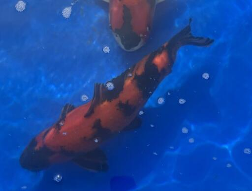
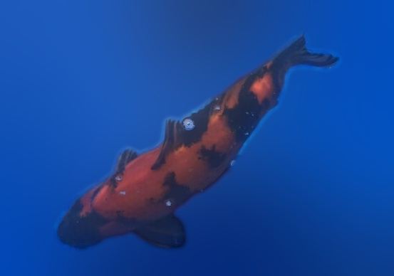

# Koi Detector Docs

This folder is intended for GitHub Pages or richer project documentation.

## Privacy Model

- Put public documentation assets in `docs/public-assets/`
- Put private local example exports in `docs/private-assets/`
- Put throwaway generated docs artifacts in `docs/generated/`

Only `docs/public-assets/` is intended for committed screenshots or example images.

## Recommended Example Set

If you want one representative walkthrough, `IMG_6008.jpg` is a good candidate.

## Example Images

These images are committed derived outputs from `IMG_6008.jpg`, not the original private photo.

Tight crop:



Gradient background publishing crop:



Suggested examples for docs:

1. Original detection with tight bounding box
2. Padded crop with `--crop-pad-x 0.20 --crop-pad-y 0.10`
3. Transparent cutout with `--segment`
4. Flat publishing crop with `--segment-export-background-crop`
5. Gradient publishing crop with `--background-crop-gradient`
6. Edge softness comparison with `--background-crop-edge-softness 1.5`, `3.5`, and `6`

## Example Commands

Use a private local source image and write outputs into ignored folders:

```bash
pnpm docs:example -- --input ~/code/showPairsOrig/jpg/IMG_6008.jpg --device mps
```

If you later approve a few assets for publication, copy only those selected files into `docs/public-assets/`.

## Public Demo JSON

The repo includes one sanitized example JSON for `IMG_6008.jpg`:

- `docs/public-assets/demo-json/IMG_6008.demo.json`

It contains:

- detector settings
- bounding boxes
- crop metadata
- segmentation metadata
- background gradient metadata

It does not include:

- the original private photo
- absolute local filesystem paths
